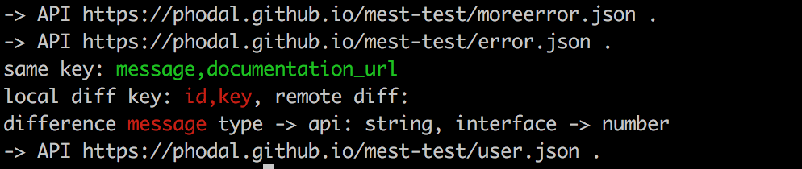

# Mest

> A Contract Test Framework for TypeScript

[](https://travis-ci.org/phodal/mest)
[](https://coveralls.io/github/phodal/mest?branch=master)
[](https://www.npmjs.com/package/mest) 
[](https://www.npmjs.com/mest)



Usage
---

1. install mest

```
npm install -g mest
```

2. run API compare 

```
mest -i data/url.csv
```

data example: 

```csv
url,interface
https://phodal.github.io/mest-test/error.json,mock/IError.ts
https://phodal.github.io/mest-test/moreerror.json,mock/IMoreIError.ts
https://phodal.github.io/mest-test/user.json,mock/IUser.ts

```

results:


```
-> API https://phodal.github.io/mest-test/moreerror.json .
-> API https://phodal.github.io/mest-test/error.json .
same key: <green>message</green>,<green>documentation_url</green>
local diff key: <red>id</red>,<red>key<red>, remote diff:
difference <red>message<red> type -> api: <red>string</red>, interface -> <red>number</red>
-> API https://phodal.github.io/mest-test/user.json .
```

License: MIT
---

[](http://ideas.phodal.com/)

© 2018 A [Phodal Huang](https://www.phodal.com)'s [Idea](http://github.com/phodal/ideas).  This code is distributed under the MIT license. See `LICENSE` in this directory.
